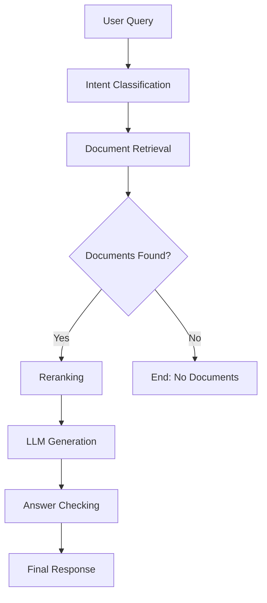

#### RAG Pipeline (LangChain/LangGraph)
### 📊 Мониторинг и дашборды (FastAPI / FastStream)

доп - может понадобиться
```bash
curl -s http://localhost:3100/loki/api/v1/label/app_name/values | jq
curl -s http://localhost:3100/loki/api/v1/labels | jq

```

В проекте используется стек **Grafana + Prometheus + Loki**:

- **Prometheus** — сбор метрик FastAPI и FastStream
- **Loki** — сбор и анализ логов сервисов

---

## 📥 Импорт дашбордов (Prometheus)

### FastAPI

**Импорт:**
1. Grafana → **Dashboards → Import**
2.  **Grafana Dashboard ID** вставить : `16110`
3. Выбрать источник данных **Prometheus** и **Loki**
4. Нажать **Import**


Для логирования FastAPI используется **Loki**.  
Логи фильтруются по label `compose_service`.

В Grafana **поправить два дашборда**.

---

### 🧾 Log of All FastAPI Apps

Показывает все логи FastAPI сервиса.

```logql
{compose_service=~"app.*"}
|= "$log_keyword"
```

---

##№ 📈 Log Type Rate (поправить sql)

Отображает частоту логов по уровням (info, warning, error и т.д.).

```logql
sum by (level) (
  rate(
    {compose_service=~"app.*"} |= "$log_keyword" [1m]
  )
)
```
---

### FastStream

- **Grafana Dashboard ID**: `22130`
- **Data Source**: `Prometheus`
- **Назначение**: метрики FastStream (producers, consumers, message rate, errors)

**Импорт:**
1. Grafana → **Dashboards → Import**
2. Вставить ID: `22130`
3. Выбрать источник данных **Prometheus**
4. Нажать **Import**

---


Этот модуль содержит реализацию **RAG** (_Retrieval-Augmented Generation_) пайплайна, построенного на основе **LangGraph**. Архитектура представлена в виде ориентированного графа, где узлы — это шаги обработки, а ребра — переходы между ними.

## 📋 Требования

- Python >= 3.11.9
- uv (для управления зависимостями)

## 🛠 Установка

### Установка uv (если не установлен)

```bash
# через pip
pip install uv
```

### Установка зависимостей проекта

```bash
# Из корня проекта
uv sync --no-install-project --all-groups

```

## 🚀 Быстрый старт

Основной точкой входа для демонстрации работы пайплайна является скрипт `example_service.py`.

### Запуск примера(только пайплайна)

#### Вариант 1: Использование uv run (рекомендуется)

```bash
# Из корня проекта
uv run python -m app.services.RAG.local_runner
```


#### Вариант 2: Активация виртуального окружения

```bash
# Активация окружения
source .venv/bin/activate  # Linux/macOS
# или
.venv\Scripts\activate     # Windows

# Установка PYTHONPATH и запуск
export PYTHONPATH=$PYTHONPATH:$(pwd)
python -m app.services.RAG.local_runner
```


### Пример успешного вывода

```text
2024-12-17 15:30:45 - INFO - example_service - Получили ответ от RAG-пайплайна:
 {'messages': [HumanMessage(content='Какой сегодня день?'), AIMessage(content='Сегодня среда, 17 декабря 2025 года.')], 'retrieved': [], 'intent': 'general'}

2024-12-17 15:30:45 - INFO - example_service - Последнее сообщение в чате:
 Сегодня среда, 17 декабря 2025 года.
```

## 🏗 Архитектура проекта

### Структура модулей

```
sevice/
├── RAG/                   # Основной RAG пайплайн
│   ├── graph/             # Построение графа
│   │   └── builder.py     # RAGGraphBuilder - конструктор графа
│   ├── nodes/             # Узлы обработки
│   │   ├── base/          # Базовые классы узлов
│   │   ├── preprocessing/ # Предобработка (Intent, Retriever)
│   │   ├── retrieval/     # Извлечение документов
│   │   └── postprocessing/# Постобработка (Reranker, AnswerChecker)
│   ├── utils/             # Утилиты
│   │   └── prompts/       # Промпты для LLM
│   ├── pipeline.py        # RAGPipeline - основной класс
│   └── state.py           # RAGState - состояние пайплайна
├── llm/                   # LLM модули
│   ├── llm.py             # AsyncLLM - асинхронный LLM
│   └── schemas.py         # Схемы данных
├── example_service.py     # Пример использования
└── exceptions.py          # Исключения
```

### Граф обработки

Пайплайн состоит из следующих узлов (см. `RAG/graph/builder.py`):

1.  **IntentClassifier (`Intent`)**: Определяет намерение пользователя (FAQ, Support, General)
2.  **RetrieverIntent (`Retriever`)**: Переформулирует запрос и выполняет поиск документов
3.  **DocsCounter (`Router`)**: Проверяет наличие найденных документов
4.  **Reranker (`Reranker`)**: Переупорядочивает документы по релевантности
5.  **BaseLLM (`llm`)**: Генерирует финальный ответ на основе контекста
6.  **AnswerChecker (`AnswerChecker`)**: (Опционально) Проверяет качество ответа

### Поток данных



Данные между узлами передаются через объект состояния `RAGState` (см. `RAG/state.py`).


## 🛠 Расширение функционала

### Добавление нового узла

Чтобы добавить новый шаг обработки (например, фильтрацию токсичности):

1.  **Создайте класс узла**:
    ```python
    # rag_langchain/RAG/nodes/safety/safety_check.py
    from rag_langchain.RAG.nodes.base.base_node import BaseNode
    from rag_langchain.RAG.state import RAGState
    from langchain_core.messages import AIMessage

    class SafetyCheck(BaseNode):
        async def ainvoke(self, state: RAGState) -> RAGState:
            # Ваша логика проверки безопасности
            user_message = state.get("messages", [])[-1].content
            is_safe = self._check_safety(user_message)

            if not is_safe:
                return {
                    "messages": state["messages"] + [
                        AIMessage(content="Извините, не могу обработать этот запрос.")
                    ]
                }
            return state

        def _check_safety(self, text: str) -> bool:
            # Реализация проверки безопасности
            return True
    ```

2.  **Зарегистрируйте узел в графе**:
    ```python
    # В rag_langchain/RAG/graph/builder.py
    from rag_langchain.RAG.nodes.safety.safety_check import SafetyCheck

    # В методе build()
    safety = SafetyCheck()
    builder.add_node("Safety", safety.ainvoke)
    builder.add_edge(START, "Safety")
    builder.add_edge("Safety", "Intent")
    ```

### Кастомизация промптов

Промпты находятся в `rag_langchain/RAG/utils/prompts/prompts.py`:

```python
CUSTOM_PROMPTS = {
    "intent_classification": """
    Определи намерение пользователя:
    - FAQ: вопросы о продукте/сервисе
    - Support: технические проблемы
    - General: общие вопросы

    Вопрос: {question}
    Намерение:
    """,
    "answer_generation": """
    Контекст: {context}
    Вопрос: {question}

    Дай краткий и точный ответ на основе контекста.
    """
}
```

## 🧪 Тестирование

### Запуск тестов

```bash
# Установка dev зависимостей
uv sync --group dev --no-install-project

# Запуск тестов (если есть)
uv run pytest

# Проверка типов
uv run mypy app/services/RAG

# Форматирование кода
uv run black app/services/RAG
uv run isort app/services/RAG
```

### Отладка

Для отладки используйте встроенное логирование:

```python
import logging
logging.basicConfig(level=logging.DEBUG)

# В rag_service.py уже настроено цветное логирование
```

## 📦 Зависимости

### Основные зависимости

- **langgraph** (>=1.0.4): Фреймворк для построения графов обработки
- **langchain-huggingface** (>=1.1.0): Интеграция с Hugging Face моделями
- **pydantic** (>=2.12.5): Валидация данных и схемы
- **torch** (>=2.9.1): Для работы с ML моделями
- **numpy** (>=2.3.5): Численные вычисления

### Dev зависимости

- **black**: Форматирование кода
- **isort**: Сортировка импортов
- **mypy**: Проверка типов
- **pre-commit**: Git хуки для качества кода

## 🚀 Производственное использование

### Docker

Создайте `Dockerfile`:

```dockerfile
FROM python:3.12-slim

WORKDIR /app
COPY pyproject.toml uv.lock ./
RUN pip install uv && uv sync --frozen

COPY . .
CMD ["uv", "run", "python", "-m", "app.service_main"]
```

### API сервер

Пример интеграции с FastAPI:

```python
from fastapi import FastAPI
from rag_langchain.RAG.pipeline import RAGPipeline
from rag_langchain.RAG.graph.builder import RAGGraphBuilder
from rag_langchain.llm.llm import AsyncLLM

app = FastAPI()
llm = AsyncLLM()
graph_builder = RAGGraphBuilder(async_llm=llm)
rag_pipeline = RAGPipeline(graph=graph_builder.build())

@app.post("/query")
async def query_rag(question: str):
    result = await rag_pipeline.query(message=question)
    return {"answer": result["messages"][-1].content}
```

## 📚 Примеры использования

### Базовое использование

```python
import asyncio
from rag_langchain.llm.llm import AsyncLLM
from rag_langchain.RAG.graph.builder import RAGGraphBuilder
from rag_langchain.RAG.pipeline import RAGPipeline

async def simple_query():
    # Инициализация компонентов
    llm = AsyncLLM()
    graph_builder = RAGGraphBuilder(async_llm=llm, use_answer_checker=True)
    rag_pipeline = RAGPipeline(graph=graph_builder.build())

    # Выполнение запроса
    result = await rag_pipeline.query(message="Что такое машинное обучение?")

    # Получение ответа
    answer = result["messages"][-1].content
    intent = result.get("intent", "unknown")
    documents = result.get("retrieved", [])

    print(f"Ответ: {answer}")
    print(f"Намерение: {intent}")
    print(f"Найдено документов: {len(documents)}")

# Запуск
asyncio.run(simple_query())
```

### Пакетная обработка

```python
async def batch_processing():
    llm = AsyncLLM()
    graph_builder = RAGGraphBuilder(async_llm=llm)
    rag_pipeline = RAGPipeline(graph=graph_builder.build())

    questions = [
        "Как работает нейронная сеть?",
        "Что такое глубокое обучение?",
        "Объясни алгоритм градиентного спуска"
    ]

    results = []
    for question in questions:
        result = await rag_pipeline.query(message=question)
        results.append({
            "question": question,
            "answer": result["messages"][-1].content,
            "intent": result.get("intent")
        })

    return results
```

### Кастомная конфигурация

```python
async def custom_config():
    # Кастомные настройки LLM
    llm = AsyncLLM(
        model_name="yandex_example",
        temperature=0.3,
        max_tokens=500
    )

    # Граф без проверки ответов
    graph_builder = RAGGraphBuilder(
        async_llm=llm,
        use_answer_checker=False
    )

    rag_pipeline = RAGPipeline(graph=graph_builder.build())

    result = await rag_pipeline.query(
        message="Техническая документация по API"
    )

    return result
```

## 🔍 Мониторинг и логирование

### Настройка детального логирования

```python
import logging
from rag_langchain.example_service import ColoredFormatter

def setup_detailed_logging():
    logger = logging.getLogger("rag_langchain")
    logger.setLevel(logging.DEBUG)

    handler = logging.StreamHandler()
    formatter = ColoredFormatter(
        fmt="%(asctime)s - %(levelname)s - %(name)s:%(lineno)d - %(message)s"
    )
    handler.setFormatter(formatter)
    logger.addHandler(handler)

    return logger
```


## 🐛 Troubleshooting

### Частые проблемы и решения

#### 1. Ошибка импорта модулей

```bash
# Проблема: ModuleNotFoundError: No module named 'rag_langchain'
# Решение: Установите PYTHONPATH или используйте uv run

export PYTHONPATH=$PYTHONPATH:$(pwd)
# или
uv run python -m app.service_main
```

#### 2. Проблемы с зависимостями

```bash
# Проблема: Конфликты версий пакетов
# Решение: Пересоздайте окружение

rm -rf .venv
uv sync --no-install-project
```

#### 3. Ошибки LLM

```python
# Проблема: Timeout или API ошибки
# Решение: Настройте retry и timeout

from tenacity import retry, stop_after_attempt, wait_exponential

class AsyncLLM:
    @retry(
        stop=stop_after_attempt(3),
        wait=wait_exponential(multiplier=1, min=4, max=10)
    )
    async def ainvoke(self, messages):
        # Ваш код LLM
        pass
```

#### 4. Проблемы с памятью

```python
# Проблема: OutOfMemoryError при обработке больших документов
# Решение: Ограничьте размер контекста

def truncate_context(documents, max_tokens=2000):
    context = ""
    for doc in documents:
        if len(context) + len(doc.page_content) > max_tokens:
            break
        context += doc.page_content + "\n"
    return context
```

### Отладочные команды

```bash
# Проверка установки
uv run python -c "import app.services.RAG.rag_pipeline; print('OK')"

# Проверка зависимостей
uv tree

# debug
uv run python -m pdb -m app.services.RAG.local_runner

# Профилирование
uv run python -m cProfile -m app.services.RAG.local_runner
```


### Разработка

1. Форкните репозиторий
2. Создайте ветку для фичи: `git checkout -b feature/amazing-feature`
3. Установите dev зависимости: `uv sync --group dev --no-install-project`
4. Настройте pre-commit: `uv run pre-commit install`
5. Внесите изменения и добавьте тесты
6. Запустите проверки: `uv run pre-commit run --all-files`
7. Создайте Pull Request

### Стиль кода

Проект использует:
- **Black** для форматирования
- **isort** для сортировки импортов
- **mypy** для проверки типов
- **pre-commit** для автоматических проверок

```bash
# Автоматическое форматирование
uv run black app/services/RAG/
uv run isort app/services/RAG/

# Проверка типов
uv run mypy app/services/RAG/
```