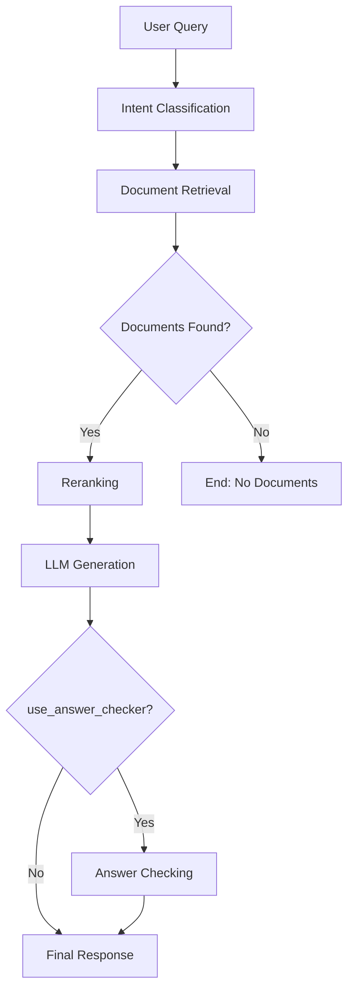

# RAG Pipeline (LangChain/LangGraph)

Этот модуль содержит реализацию **RAG** (_Retrieval-Augmented Generation_) пайплайна, построенного на основе **LangGraph**. Архитектура представлена в виде ориентированного графа, где узлы — это шаги обработки, а ребра — переходы между ними.

## 📋 Требования

- Python >= 3.11.9
- uv (для управления зависимостями)

## 🛠 Установка

### Установка uv (если не установлен)

```bash
# через pip
pip install uv
```

### Установка зависимостей проекта

```bash
# Из корня проекта
uv sync --no-install-project --all-groups
```

## 🚀 Быстрый старт

Основной точкой входа для демонстрации работы пайплайна является скрипт `local_runner.py`.

### Запуск примера (только пайплайна)

#### Вариант 1: Использование uv run (рекомендуется)

```bash
# Из корня проекта
uv run python -m app.services.RAG.local_runner
```

#### Вариант 2: Активация виртуального окружения

```bash
# Активация окружения
source .venv/bin/activate  # Linux/macOS
# или
.venv\Scripts\activate     # Windows

# Установка PYTHONPATH и запуск
export PYTHONPATH=$PYTHONPATH:$(pwd)
python -m app.services.RAG.local_runner
```

### Пример успешного вывода

```text
2024-12-17 15:30:45 - INFO - local_runner - Получили ответ от RAG-пайплайна:
 {'messages': [HumanMessage(content='Какие документы нужны для оформления ипотеки?'), AIMessage(content='...')], 'retrieved': [...], 'intent': [...]}

2024-12-17 15:30:45 - INFO - local_runner - Последнее сообщение в чате:
 Для оформления ипотеки вам потребуются следующие документы...
```

## 🏗 Архитектура проекта

### Структура модулей

```
app/services/
├── RAG/                           # Основной RAG модуль
│   ├── rag_pipeline/              # Пайплайн RAG
│   │   ├── graph/                 # Построение графа
│   │   │   └── builder.py         # RAGGraphBuilder — конструктор графа
│   │   ├── nodes/                 # Узлы обработки
│   │   │   ├── base/              # Базовые классы
│   │   │   │   ├── base_node.py   # BaseNode — абстрактный узел
│   │   │   │   └── base_llm.py    # BaseLLM — узел генерации ответа
│   │   │   ├── preprocessing/     # Предобработка
│   │   │   │   ├── intent.py      # IntentClassifier — классификация намерений
│   │   │   │   └── router.py      # DocsCounter — условная маршрутизация
│   │   │   ├── retrieval/         # Работа с документами
│   │   │   │   ├── retriever.py   # RetrieverIntent — поиск документов
│   │   │   │   └── reranker.py    # Reranker — переранжирование
│   │   │   └── postprocessing/    # Постобработка
│   │   │       └── answer_checker.py  # AnswerChecker — проверка ответа
│   │   ├── embeddings/            # Эмбеддинги
│   │   │   └── embedding.py       # Embedding — модель эмбеддингов
│   │   ├── utils/                 # Утилиты
│   │   │   └── prompts/           # Промпты для LLM
│   │   │       ├── prompts.py     # Шаблоны промптов
│   │   │       └── manager.py     # PromptManager — менеджер промптов
│   │   ├── pipeline.py            # RAGPipeline — основной класс пайплайна
│   │   └── state.py               # RAGState — состояние пайплайна
│   ├── llm/                       # LLM модули
│   │   ├── llm.py                 # AsyncLLM, LocalAsyncYandexLLM, LocalAsyncOllamaLLM
│   │   ├── schemas.py             # Pydantic-схемы ответов LLM
│   │   ├── EPA/                   # EPA Token Manager
│   │   │   ├── epa_token.py       # EPATokenManager
│   │   │   ├── schemas.py         # Схемы EPA
│   │   │   └── exceptions.py      # Исключения EPA
│   │   └── TYK/                   # TYK API Gateway
│   │       ├── yandex.py          # TYKClient
│   │       └── exceptions.py      # Исключения TYK
│   ├── local_runner.py            # Локальный запуск пайплайна
│   ├── exceptions.py              # RagPipelineError
│   └── README.md                  # Этот файл
├── rag_service.py                 # RagService — бизнес-сервис
└── ...
```

### DependencyContainer

Контейнер зависимостей (`app/core/container.py`) управляет ленивой инициализацией всех компонентов RAG:

```python
from app.core.config import CONFIG
from app.core.container import DependencyContainer

container = DependencyContainer(config=CONFIG)

# Ленивая инициализация
llm = container.llm                    # AsyncLLM или LocalAsyncYandexLLM
graph_builder = container.graph_builder  # RAGGraphBuilder
pipeline = container.pipeline          # RAGPipeline
service = container.service            # RagService
```

### Граф обработки

Пайплайн состоит из следующих узлов (см. `rag_pipeline/graph/builder.py`):

1. **IntentClassifier (`Intent`)**: Определяет намерение пользователя, переформулирует запрос для векторного поиска
2. **RetrieverIntent (`Retriever`)**: Выполняет поиск документов в VectorDB (OpenSearch)
3. **DocsCounter (`Router`)**: Условная маршрутизация — проверяет наличие найденных документов
4. **Reranker (`Reranker`)**: Переупорядочивает документы по релевантности
5. **BaseLLM (`llm`)**: Генерирует финальный ответ на основе контекста
6. **AnswerChecker (`AnswerChecker`)**: (Опционально) Проверяет качество ответа

### Поток данных



### RAGState

Данные между узлами передаются через объект состояния `RAGState` (см. `rag_pipeline/state.py`):

```python
class RAGState(TypedDict, total=False):
    messages: Annotated[list[BaseMessage], add_messages]  # История сообщений
    retrieved: list[Any]                                   # Найденные документы
    intent: Annotated[list[BaseMessage], add_messages]     # Классификация намерений
```

## 🛠 Расширение функционала

### Добавление нового узла

Чтобы добавить новый шаг обработки (например, фильтрацию токсичности):

1. **Создайте класс узла**:

    ```python
    # app/services/RAG/rag_pipeline/nodes/safety/safety_check.py
    from app.services.RAG.rag_pipeline.nodes.base.base_node import BaseNode
    from app.services.RAG.rag_pipeline.state import RAGState
    from langchain_core.messages import AIMessage

    class SafetyCheck(BaseNode):
        async def ainvoke(self, state: RAGState) -> dict:
            # Ваша логика проверки безопасности
            user_message = state.get("messages", [])[-1].content
            is_safe = self._check_safety(user_message)

            if not is_safe:
                return {
                    "messages": [
                        AIMessage(content="Извините, не могу обработать этот запрос.")
                    ]
                }
            return {}

        def _check_safety(self, text: str) -> bool:
            # Реализация проверки безопасности
            return True
    ```

2. **Зарегистрируйте узел в графе**:

    ```python
    # В app/services/RAG/rag_pipeline/graph/builder.py
    from app.services.RAG.rag_pipeline.nodes.safety.safety_check import SafetyCheck

    # В методе _build_graph()
    safety = SafetyCheck()
    builder.add_node("Safety", safety.ainvoke)
    builder.add_edge(START, "Safety")
    builder.add_edge("Safety", "Intent")
    ```

3. **Добавьте промпт** (если узел использует LLM):

    ```python
    # В app/services/RAG/rag_pipeline/utils/prompts/prompts.py
    all_prompts = {
        # ... существующие промпты ...
        "SafetyCheck": [
            "Проверьте сообщение на безопасность: {message}",
        ],
    }
    ```

### Кастомизация промптов

Промпты хранятся в `rag_pipeline/utils/prompts/prompts.py`:

```python
all_prompts = {
    "BaseLLM": [
        "Как профессиональный AI-ассистент... Пользователь написал: {message}, "
        "наша переписка: {history}, есть контекст: {context}. Что вы ответите?",
    ],
    "Classifier": [
        "Определите намерение пользователя... Сообщение: {message}, история: {history}.",
    ],
    "Retriever": [
        "Измените сообщение для улучшения векторного поиска. Сообщение: {message}.",
    ],
    "AnswerChecker": [
        "Проверьте релевантность ответа. Вопрос: {message}, ответ: {answer}, контекст: {context}.",
    ],
}
```

## 🧪 Тестирование

### Запуск тестов

```bash
# Установка dev зависимостей
uv sync --group dev --no-install-project

# Запуск тестов
uv run pytest

# Проверка типов
uv run mypy app/services/RAG

# Форматирование кода
uv run black app/services/RAG
uv run isort app/services/RAG
```

### Отладка

Для отладки используйте встроенное логирование:

```python
import logging
logging.basicConfig(level=logging.DEBUG)

# Логи с emoji-префиксами:
# ✅ успех, ❌ ошибка, 🔧 инициализация, 🚀 запуск, 💤 остановка
```

## 📦 Зависимости

### Основные зависимости

- **langgraph** (>=1.0.4): Фреймворк для построения графов обработки
- **langchain-core**: Базовые абстракции LangChain
- **pydantic** (>=2.0): Валидация данных и схемы
- **httpx**: Асинхронный HTTP-клиент
- **tenacity**: Retry-логика для API-вызовов
- **torch**: Для работы с ML моделями (эмбеддинги, реранкер)

### Dev зависимости

- **black**: Форматирование кода
- **isort**: Сортировка импортов
- **mypy**: Проверка типов
- **pre-commit**: Git хуки для качества кода
- **pytest**: Тестирование

## 🚀 LLM Провайдеры

Проект поддерживает несколько вариантов LLM:

### 1. AsyncLLM (TYK или RnD режим)

```python
from app.services.RAG.llm.llm import AsyncLLM

# Конфигурируется через EnvConfig
# use_tyk=True  → EPA + TYK API Gateway
# use_tyk=False → Прямое подключение через rnd_connectors
```

### 2. LocalAsyncYandexLLM (для локальной разработки)

```python
from app.services.RAG.llm.llm import LocalAsyncYandexLLM

llm = LocalAsyncYandexLLM(
    api_key="your-yandex-api-key",
    folder_id="your-folder-id",
    model="yandexgpt-lite",
    url="https://llm.api.cloud.yandex.net/foundationModels/v1/completion",
)
```

### 3. LocalAsyncOllamaLLM (для локальной разработки с Ollama)

```python
from app.services.RAG.llm.llm import LocalAsyncOllamaLLM

llm = LocalAsyncOllamaLLM(
    model="mistral",              # или "llama3.2:3b"
    base_url="http://127.0.0.1:11434",
    temperature=0.82,
    max_tokens=2000,
)
```

## 📚 Примеры использования

### Базовое использование

```python
import asyncio
from app.core.config import CONFIG
from app.core.container import DependencyContainer

async def simple_query():
    container = DependencyContainer(config=CONFIG)

    try:
        await container.init_async()
        rag_pipeline = container.pipeline

        result = await rag_pipeline.query(
            message="Какие документы нужны для оформления ипотеки?"
        )

        answer = result["messages"][-1].content
        intent = result.get("intent", [])
        documents = result.get("retrieved", [])

        print(f"Ответ: {answer}")
        print(f"Найдено документов: {len(documents)}")
    finally:
        await container.aclose()

asyncio.run(simple_query())
```

### Пакетная обработка

```python
async def batch_processing():
    container = DependencyContainer(config=CONFIG)
    await container.init_async()
    rag_pipeline = container.pipeline

    questions = [
        "Как работает нейронная сеть?",
        "Что такое глубокое обучение?",
        "Объясни алгоритм градиентного спуска",
    ]

    results = []
    for question in questions:
        result = await rag_pipeline.query(message=question)
        results.append({
            "question": question,
            "answer": result["messages"][-1].content,
        })

    await container.aclose()
    return results
```

### Визуализация графа

```python
from app.core.config import CONFIG
from app.core.container import DependencyContainer

container = DependencyContainer(config=CONFIG)
graph_builder = container.graph_builder

# Отобразить граф в Jupyter Notebook
graph_builder.get_image_graph()
```

## 🐛 Troubleshooting

### Частые проблемы и решения

#### 1. Ошибка импорта модулей

```bash
# Проблема: ModuleNotFoundError: No module named 'app'
# Решение: Установите PYTHONPATH или используйте uv run

export PYTHONPATH=$PYTHONPATH:$(pwd)
# или
uv run python -m app.services.RAG.local_runner
```

#### 2. Проблемы с зависимостями

```bash
# Проблема: Конфликты версий пакетов
# Решение: Пересоздайте окружение

rm -rf .venv
uv sync --no-install-project --all-groups
```

#### 3. Ошибки LLM

```python
# Проблема: Timeout или API ошибки
# Решение: Проверьте переменные окружения и retry-логику

# В .env файле:
YC_API_KEY=your-api-key
YC_FOLDER_ID=your-folder-id
```

#### 4. Проблемы с памятью

```python
# Проблема: OutOfMemoryError при обработке больших документов
# Решение: RAGPipeline использует torch.no_grad() для экономии памяти

# Дополнительно можно ограничить размер контекста в промптах
```

### Отладочные команды

```bash
# Проверка установки
uv run python -c "from app.services.RAG.rag_pipeline import pipeline; print('OK')"

# Проверка зависимостей
uv tree

# Debug режим
uv run python -m pdb -m app.services.RAG.local_runner

# Профилирование
uv run python -m cProfile -m app.services.RAG.local_runner
```

## 🔧 Разработка

1. Форкните репозиторий
2. Создайте ветку для фичи: `git checkout -b feature/amazing-feature`
3. Установите dev зависимости: `uv sync --group dev --no-install-project`
4. Настройте pre-commit: `uv run pre-commit install`
5. Внесите изменения и добавьте тесты
6. Запустите проверки: `uv run pre-commit run --all-files`
7. Создайте Pull Request

### Стиль кода

Проект использует:

- **Black** для форматирования (line-length: 120)
- **isort** для сортировки импортов
- **mypy** для проверки типов
- **pre-commit** для автоматических проверок

```bash
# Автоматическое форматирование
uv run black app/services/RAG/
uv run isort app/services/RAG/

# Проверка типов
uv run mypy app/services/RAG/
```

### Порядок импортов

```python
# 1. Standard library
import logging
from typing import Any

# 2. Third-party
from langchain_core.messages import BaseMessage
from langgraph.graph import StateGraph

# 3. Local (app.*)
from app.core.config import CONFIG
from app.services.RAG.rag_pipeline.state import RAGState
```
